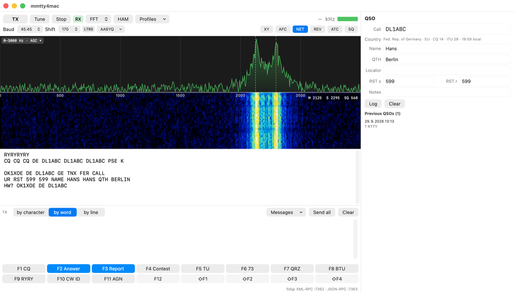
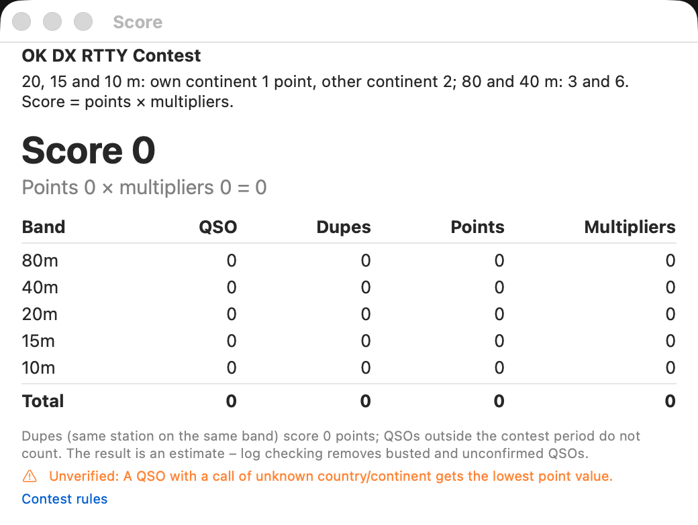
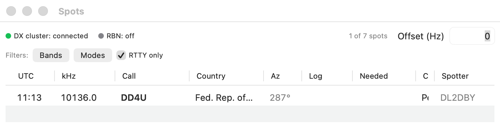
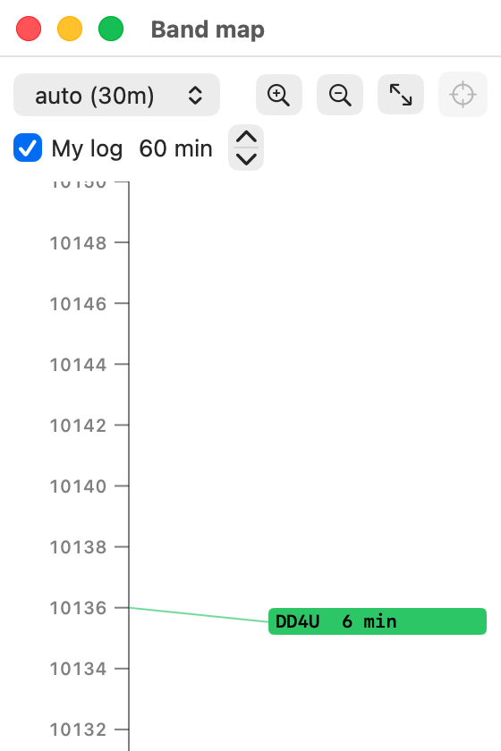

# RYRY

A native macOS RTTY application based on MMTTY (JE3HHT, Makoto Mori). Published on the Mac App Store as **RYRY**
(website: https://ok1xoe.dev/ryry/). Formerly mmtty4mac; renamed to RYRY in version 1.0 (repository, bundle ID
`cz.ok1xoe.ryry`, data folder `Application Support/RYRY` – the old folder and preferences are moved on the first launch).

- Original sources: https://github.com/n5ac/mmtty (see http://mm-open.org)
- Licence: GNU LGPL v3 (see COPYING and COPYING.LESSER)
- User manual: docs/manual.md (English), docs/prirucka.md (the Czech original); HTML in docs/html (English in docs/html/en/). The rest of the documentation under docs/ is in Czech.
- Design: docs/superpowers/specs/2026-09-28-mmtty4mac-design.md

## Screenshots

The main window: spectrum and waterfall (click tunes to mark), the receive pane
(click a word to put it in the QSO), the transmit pane, macros F1-F12 and the QSO
panel with callbook data and previous QSOs.

| Contest score | DX cluster spots | Band map |
|---|---|---|
|  |  |  |
| Points, QSOs and multipliers per band and in total, for 28 RTTY contests. | Spots from a DX cluster and the RBN, with band and mode filters. | The RTTY segment of the band with spots and the rig position. |

More screenshots are in the manual: [English](docs/html/en/index.html), [Czech](docs/html/cs/index.html).

## Development

Requires Xcode (Swift Testing). If `xcode-select` points at the Command Line Tools,
run with `DEVELOPER_DIR`:

    export DEVELOPER_DIR=/Applications/Xcode.app/Contents/Developer
    swift build
    swift test

## The rtty-tool utility

    swift build -c release
    # standalone RTTY generator (optionally with noise)
    .build/release/rtty-tool gen "CQ CQ DE OK1XOE K" cq.wav --noise 0.1
    # transmitter of the MMTTY core
    .build/release/rtty-tool encode "TEST DE OK1XOE" tx.wav
    # WAV decoding (11025 or 12000 Hz, mono)
    .build/release/rtty-tool decode cq.wav [--demod iir|fir|pll|fft] [--baud 45.45] [--mark 2125] [--shift 170] [--no-afc]

Convert a recording from your receiver to 11025 Hz mono: `ffmpeg -i in.wav -ar 11025 -ac 1 out.wav`.

## Live operation (Engine)

    rtty-tool devices                       # sound devices and serial ports
    rtty-tool level --in <UID>              # input level
    rtty-tool live --in <UID> --out <UID> --ptt cat --rig hamlib     # rigctld on 127.0.0.1:4532
    rtty-tool live ... --ptt rts --port /dev/cu.usbserial-X --fsk uart

In `live` mode every line from stdin is transmitted (TX → text → RX once the transmission finishes). Also `:tx`, `:rx`, `:tune`, `:q`.
Manual hardware tests: `docs/hardware-checklist.md`.

## API for other programs

`rtty-tool live` also starts the API (it can be turned off in `settings.json` or with the `--no-api` switch):

- **fldigi XML-RPC** `http://127.0.0.1:7362/RPC2` – loggers that speak fldigi work without any change.
- **JSON-RPC 2.0 / WebSocket** `ws://127.0.0.1:7363/v1` – with events (received text, state, AFC, rig, log).

Details: `docs/api.md`. Settings: `~/Library/Application Support/RYRY/settings.json` for `rtty-tool`; the sandboxed
app keeps them in `~/Library/Containers/cz.ok1xoe.ryry/Data/Library/Application Support/RYRY/`.

## The application (GUI)

    ./scripts/make-app.sh          # builds build/RYRY.app (RYRY, App Sandbox, signed with Apple Development, otherwise ad-hoc)
    open build/RYRY.app
    TEAM_ID=… ./scripts/release-appstore.sh   # App Store build and upload (docs/distribution.md, docs/appstore/README.md)

On first launch macOS asks for microphone access (receiving from the radio) – grant it.
With a stable signature (Apple Development) macOS remembers the permission; with an ad-hoc signature (`SIGN_ID=-`) it asks after every build.
Main window: waterfall (click = tune to mark), receive pane (click a word = call/name/RST into the QSO),
transmit pane (by characters/words/lines), 16 macros F1–F12 and ⇧F1–⇧F4 (right click = edit, repeat = CQ loop),
a QSO panel with previous QSOs and the DXCC entity, the Log window (⇧⌘L), Settings (⌘,). Keys: ⌘T TX/RX, Esc for immediate RX, ⌘L to log.

Further features from MMTTY:
- BPF, AA6YQ and notch/LMS filters (right click in the spectrum = notch, as in MMTTY), PLL parameters, TX filters, wait between characters, random diddle;
- sound card clock calibration in ppm (Settings → Audio → Measure; Core Audio measures the real frequency against the system clock);
- contest mode: serial numbers, click a number in the receive pane = received number, Cabrillo 3.0 export (Log → Export Cabrillo…);
- spectrum/waterfall range and gain (the menu in the corner of the spectrum), LTRS/FIGS indicator, UOS, J-BELL, timestamps, font size;
- DXCC from `cty.dat` (AD1C; your own version can be placed in `Application Support/RYRY/cty.dat` inside the app container), the `%g` greeting based on the other station's local time;
- playing a WAV into the receive path (File → Play WAV into receive);
- a message list (the "Messages" menu next to the transmit pane), macro button colours, demodulator scope (Window → Demodulator scope);
- contest exchange formats RST + number, RST + number + text, RST + text, CQ/RJ (zone + QTH), BARTG (number + time), PED and
  WAE with the QTC exchange (both sending and receiving a series in the QSO panel, limits per the DARC rules, QTC in Cabrillo);
- 28 RTTY contest presets (every HF RTTY contest on contestcalendar.com) with the exchange, points, multipliers, dupes and
  dates per the official rules, and a rules overview in Settings → Contest.
